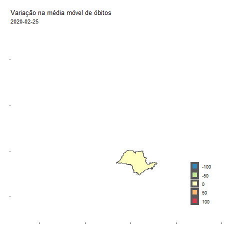
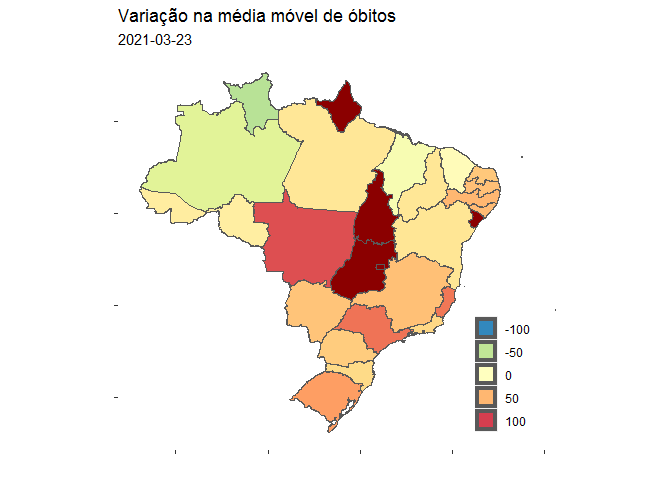

# Mapas animados do Covid-19

Scripts em R para gerar gifs animados com a evolução da média móvel de
óbitos em deocorrência do Covid-19 nos estados e municípios brasileiros,
desde o primeiro caso registrado, em fevereiro de 2020, até o dia atual.

<!-- -->

## Como gerar o mapa no R

### Carregando os pacotes

``` r
# bibliotecas utilizadas
library(data.table)
library(sf)
library(geobr)
library(tidyverse)
library(gganimate)
library(transformr)
library(av)
library(ggspatial)
# funcao para calcular a media movel
source("calcula_mm.R")
```

## Conjunto de dados

Utilizamos a base de dados de estados e municípios disponibilizada e
atualizada diariamente por *Wesley Cota* em
<https://github.com/wcota/covid19br>

Vamos ler os dados diretamente do github com auxílio da rápida função
`fread` do pacote `data.table`

``` r
dados_estados <- fread("https://raw.githubusercontent.com/wcota/covid19br/master/cases-brazil-states.csv") |> calcula_mm()
dados_estados$date <- lubridate::as_date(dados_estados$date)
```

## Geometrias dos estados

Em seguida, precisamos das geometrias dos estados brasileiros, e vamos
utilizar o `geobr` para carregá-las no ambiente de execução.

``` r
sf_states <- read_state()
```

    ##   |                                                                              |                                                                      |   0%  |                                                                              |===                                                                   |   4%  |                                                                              |=====                                                                 |   7%  |                                                                              |========                                                              |  11%  |                                                                              |==========                                                            |  15%  |                                                                              |=============                                                         |  19%  |                                                                              |================                                                      |  22%  |                                                                              |==================                                                    |  26%  |                                                                              |=====================                                                 |  30%  |                                                                              |=======================                                               |  33%  |                                                                              |==========================                                            |  37%  |                                                                              |=============================                                         |  41%  |                                                                              |===============================                                       |  44%  |                                                                              |==================================                                    |  48%  |                                                                              |====================================                                  |  52%  |                                                                              |=======================================                               |  56%  |                                                                              |=========================================                             |  59%  |                                                                              |============================================                          |  63%  |                                                                              |===============================================                       |  67%  |                                                                              |=================================================                     |  70%  |                                                                              |====================================================                  |  74%  |                                                                              |======================================================                |  78%  |                                                                              |=========================================================             |  81%  |                                                                              |============================================================          |  85%  |                                                                              |==============================================================        |  89%  |                                                                              |=================================================================     |  93%  |                                                                              |===================================================================   |  96%  |                                                                              |======================================================================| 100%

Agora, vamos juntar os dois datasets utilizando a sigla de cada estado
como chave primária. Dessa forma, agora todas as observações, além do
dia e número de casos, contém também as respectivas geometrias.

``` r
sf_covid_states <- inner_join(dados_estados, sf_states, by = c("state" = "abbrev_state"))
```

Vamos plotar o mapa em uma data especifica para testar

``` r
sf_covid_states |> filter(date == "2021-03-23")|>
  ggplot() +
  geom_sf(aes(fill = var_mm_deaths,geometry = geom))+#,color = NA)+
  ggtitle("Variação na média móvel de óbitos", subtitle = "2021-03-23")+
  scale_fill_distiller(palette = "Spectral",limits = c(-100,100), na.value = "darkred") +
  labs(x = " ", y = " ",fill = " ") +
  theme(legend.position = c(0.84,0.22),
        axis.text.x = element_blank(),
        axis.text.y = element_blank(),
        panel.background = element_rect(fill = "transparent"))+
  guides(fill = guide_legend(override.aes = list(color = NA) ) )
```

<!-- -->

Parece que está tudo certo!

## Plot animado

Vamos agora criar o group necessario para a animação

``` r
sf_covid_states$group<- as.numeric(sf_covid_states$date - min(sf_covid_states$date))
```

Finalmente, vamos agora criar o gráfico animado com auxílio do
gganimate. Nesse exemplo, diminuí a quantidade de frames usando o
comando `filter()`

``` r
# plota o mapa animado
gpl1 <- sf_covid_states |> filter(group %in% c(380,430))|>
  ggplot() +
  geom_sf(aes(fill = var_mm_deaths,
              group = group,
              geometry = geom))+#,color = NA)+
  ggtitle("Variação na média móvel de óbitos",
          subtitle = "{frame_time}")+
  scale_fill_distiller(palette = "Spectral",
                       limits = c(-100,100),
                       na.value = "darkred") +
  labs(x = " ",
       y = " ",
       fill = " ") +
  theme(legend.position = c(0.84,0.22),
        axis.text.x = element_blank(),
        axis.text.y = element_blank(),
        panel.background = element_rect(fill = "transparent"),
        plot.background = element_rect(fill = "white"))+
  guides(fill = guide_legend(override.aes = list(size = 3) ) )+
  transition_time(date)+
  ease_aes('linear') +
  enter_fade() +
  exit_fade()
```

Agora que criamos nosso objeto no `ggplot`, vamos renderizar a animação.
Essa é a parte mais demorada do código.

``` r
ani <- animate(gpl1, fps = 5, nframes = 50)
```

Após renderizar, podemos salvar o gif com a função `anim_save()`, muito
similar a `ggsave()`

``` r
# salva o gif na pasta do projeto
anim_save("estados.gif", ani)
```

Como alternativa, podemos também salvar em formato de vídeo

``` r
vid <- animate(gpl1, renderer = av_renderer(), nframes = max(sf_covid_states$group), fps = 5)

# salva o vídeo
anim_save("estados.webm", vid)
```

## Referências

-   [A Grammar of Animated Graphics - gganimate](https://gganimate.com/)
-   [Criando mapas com os pacotes tidyverse e geobr - Beatriz
    Milz](https://beatrizmilz.com/blog/2020-07-27-criando-mapas-com-os-pacotes-tidyverse-e-geobr/)
-   [“Monitoring the number of COVID-19 cases and deaths in brazil at
    municipal and federative units level” - W.
    Cota](https://10.1590/scielopreprints.362)
-   [Dashboard interativo do Covid-19 -
    PREDICT-ICMC](https://github.com/predict-icmc/covid-shiny)
