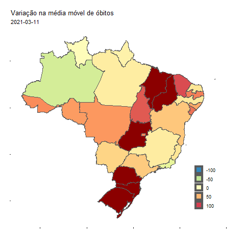

# Mapas animados do Covid-19

Scripts em R para gerar gifs animados com a evolução da média móvel de óbitos em deocorrência do Covid-19 nos estados e municípios brasileiros, desde o primeiro caso registrado, em fevereiro de 2020, até o dia atual.


```{r echo = FALSE}

```


## Como gerar o mapa no R

### Carregando os pacotes

```{r load-pkgs, warning=FALSE}
# bibliotecas utilizadas
library(data.table)
library(leaflet)
library(geobr)

library(tidyverse)
library(gganimate)
library(transformr)
library(av)
library(ggspatial)
# funcao para calcular a media movel
source("calcula_mm.R")
```

## Conjunto de dados

Utilizamos a base de dados de estados e municípios disponibilizada e atualizada diariamente por *Wesley Cota* em https://github.com/wcota/covid19br

Vamos ler os dados diretamente do github com auxílio do pacote `data.table`

```{r read-data}
dados_estados <- fread("https://raw.githubusercontent.com/wcota/covid19br/master/cases-brazil-states.csv") |> calcula_mm()
dados_estados$date <- lubridate::as_date(dados_estados$date)
```

## Geometrias dos estados

Em seguida, precisamos das geometrias dos estados brasileiros, e vamos utilizar o `geobr` para carregá-las no ambiente de execução.

```{r read-sf, message=F}
sf_states <- read_state()
```

Agora, vamos unir os dois datasets em um só, utilizando a sigla de cada estado.

```{r join-df}
sf_covid_states <- inner_join(dados_estados, sf_states, by = c("state" = "abbrev_state"))
```


Plotando uma data especifica como teste

```{r}
sf_covid_states |> filter(date == "2021-03-23")|>
  ggplot() +
  geom_sf(aes(fill = var_mm_deaths,geometry = geom))+#,color = NA)+
  ggtitle("Variação na média móvel de óbitos", subtitle = "2021-03-23")+
  scale_fill_distiller(palette = "Spectral",limits = c(-100,100), na.value = "darkred") +
  labs(x = " ", y = " ",fill = " ") +
  theme(legend.position = c(0.84,0.22),
        axis.text.x = element_blank(),
        axis.text.y = element_blank(),
        panel.background = element_rect(fill = "transparent"))+
  guides(fill = guide_legend(override.aes = list(size = 3) ) )

```

Parece que está tudo certo! 

## Plot animado

Vamos agora criar o group necessario para a animação

```{r create-grp}

sf_covid_states$group<- as.numeric(sf_covid_states$date - min(sf_covid_states$date))

```

Finalmente, vamos agora criar o gráfico animado com auxílio do gganimate. Nesse exemplo, diminuí a quantidade de frames usando o comando `filter()`

```{r animated-plot, eval=FALSE}
# plota o mapa animado
gpl1 <- sf_covid_states |> filter(group %in% c(380,450))|>
  ggplot() +
  geom_sf(aes(fill = var_mm_deaths,
              group = group,
              geometry = geom))+#,color = NA)+
  ggtitle("Variação na média móvel de óbitos",
          subtitle = "{frame_time}")+
  scale_fill_distiller(palette = "Spectral",
                       limits = c(-100,100),
                       na.value = "darkred") +
  labs(x = " ",
       y = " ",
       fill = " ") +
  theme(legend.position = c(0.84,0.22),
        axis.text.x = element_blank(),
        axis.text.y = element_blank(),
        panel.background = element_rect(fill = "transparent"),
        plot.background = element_rect(fill = "white"))+
  guides(fill = guide_legend(override.aes = list(size = 3) ) )+
  transition_time(date)+
  ease_aes('linear') +
  enter_fade() +
  exit_fade()

```

Agora que criamos nosso objeto no `ggplot`, vamos renderizar a animação. Essa é a parte mais demorada do código.

```{r eval=FALSE}

ani <- animate(gpl1, fps = 10)
```

Após renderizar, podemos salvar o gif com a função `anim_save()`, muito similar a `ggsave()`

```{r eval=FALSE}
# salva o gif na pasta do projeto
anim_save("estados.gif", ani)
```

Como alternativa, podemos também salvar em formato de vídeo

```{r salve-video, eval=FALSE}
vid <- animate(gpl1, renderer = av_renderer())

# salva o vídeo
anim_save("estados.webm", vid)
```

## Referências

 - [A Grammar of Animated Graphics - gganimate](https://gganimate.com/)
 - [Criando mapas com os pacotes tidyverse e geobr - Beatriz Milz](https://beatrizmilz.com/blog/2020-07-27-criando-mapas-com-os-pacotes-tidyverse-e-geobr/)
 - [“Monitoring the number of COVID-19 cases and deaths in brazil at municipal and federative units level" - W. Cota](10.1590/scielopreprints.362)
 - [Dashboard interativo do Covid-19 - PREDICT-ICMC](https://github.com/predict-icmc/covid-shiny)
